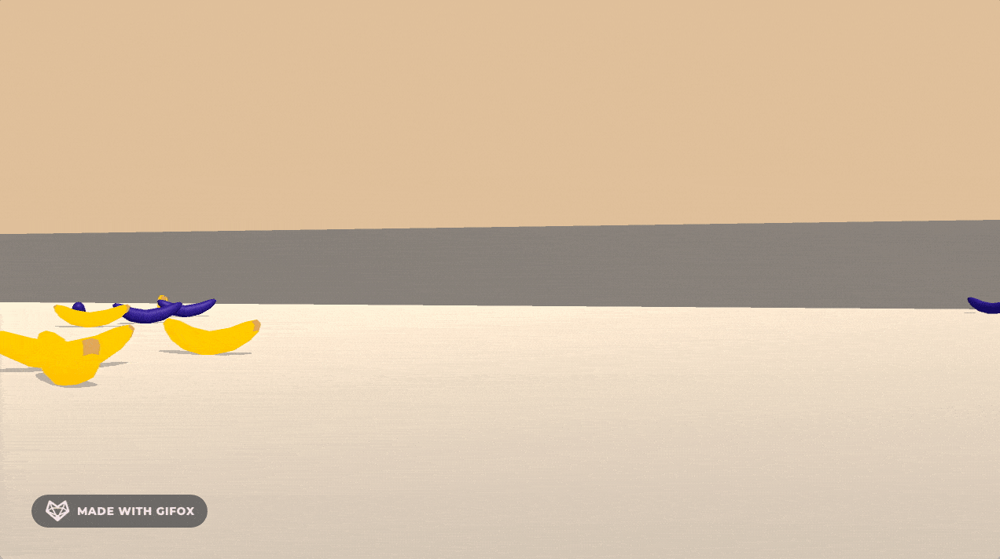

# Bananas RL

Deep Q-Learning agent learns how to navigate a world full of bananas.

The agent in this project uses the following RL techniques:

- Prioritized Experience Replay
- Double DQN (DDQN)
- Dueling DQN

## Overview

To be successful in this environment, the RL agent must learn to collect yellow bananas (reward `+1`) while avoiding blue bananas (reward `-1`).

The state has a size of `37` and contains information such as the agent's velocity and ray-based perception of objects in front of the agent.

Action space:

- `0`: Forward
- `1`: Backward
- `2`: Turn left
- `3`: Turn right

The environment is solved if the agent achieves an average score of `+13` over 100 consecutive episodes.

## Setup

Follow the instructions [here](https://github.com/udacity/deep-reinforcement-learning/tree/dc65050c8f47b365560a30a112fb84f762005c6b#dependencies) to:

1. Create a `conda` environment.
2. Clone the Udacity Deep RL repository.
3. Install Python packages into the environment.
4. Create an IPython kernel using the environment.

The OpenAI Gym instructions can be skipped.

## Notebook

Once you've completed the setup, you can:

1. Open `Navigation.ipynb`.
2. Select the kernel created during setup.
3. Run all the cells in the notebook to train the agent.

## Watching the agent

Follow the instructions [here](https://github.com/udacity/deep-reinforcement-learning/tree/dc65050c8f47b365560a30a112fb84f762005c6b/p1_navigation), load the saved neural network weights (`checkpoint.pth`), and watch the trained agent play the game!
